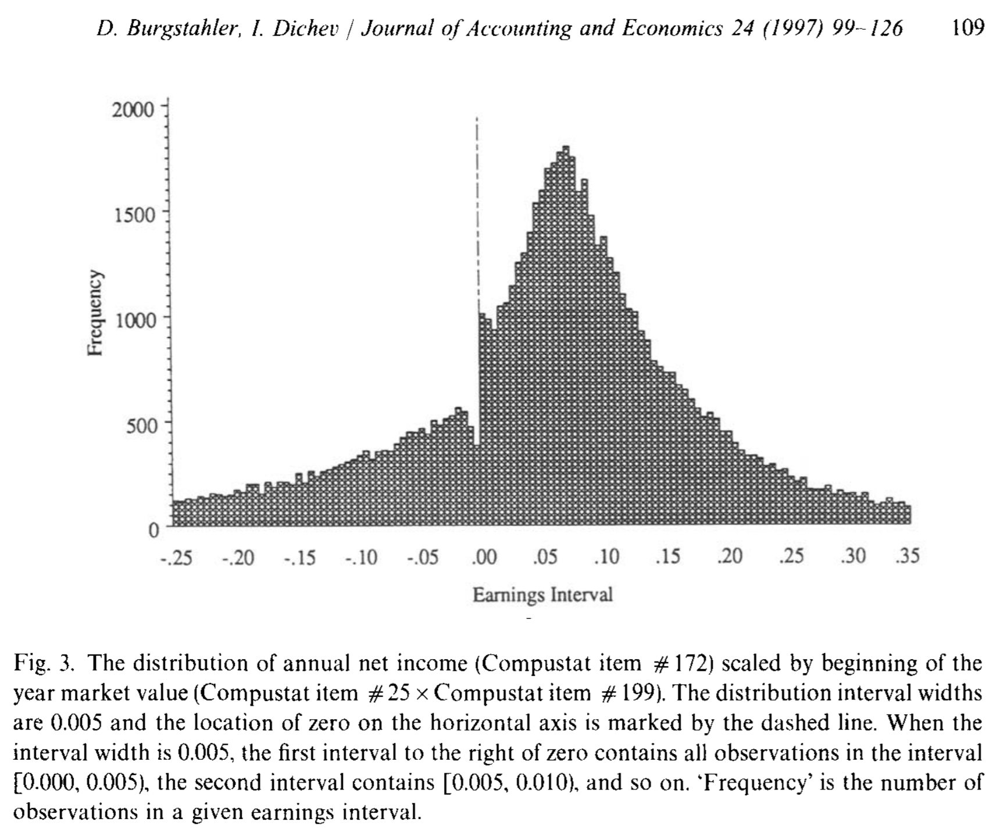
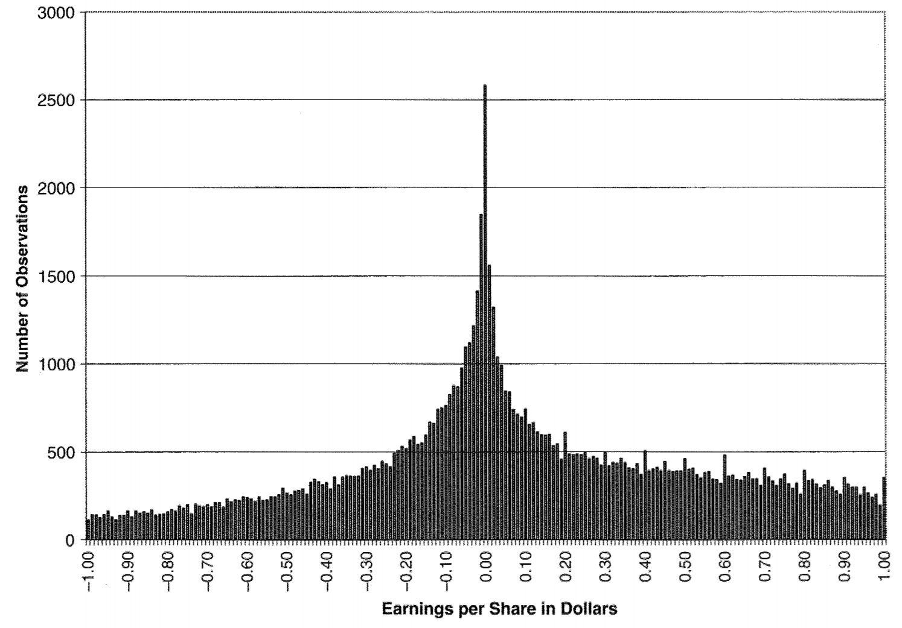
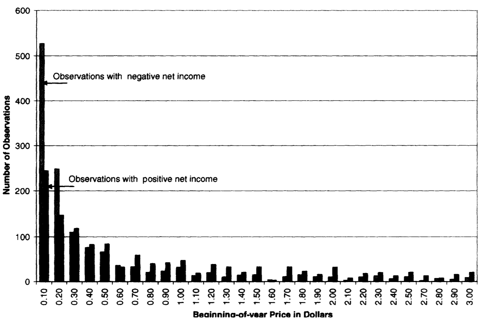

# Scaling

## Heteroscedasticity

One of the problems of heteroscadasticity is that you may get significant results for variables that are driven by scale.

Let's run a regression where we run market value on the number of employees:

```SAS
%let wrds = wrds-cloud.wharton.upenn.edu 4016;options comamid = TCP remote=WRDS;
signon username=_prompt_;

rsubmit;
	proc sql;
		create table myCompustat as
		select gvkey, fyear, prcc_f * csho as marketcap, at, ceq, emp, prcc_f 
		from comp.funda 
		where
			2006 <= fyear <= 2015
			and missing(prcc_f + csho + at + ceq + emp) eq 0
			and indfmt='INDL' and datafmt='STD' and popsrc='D' and consol='C'; 
	quit;
	proc download data=myCompustat out=myComp;run;
endrsubmit;

/* Does the number of employees explain market cap? */
proc reg data=myComp;   
  model marketcap = emp;  
quit;

```

## Choice of scalar 

To deal with size effects driving regression results you need to select an appropriate scalar. 

### Earnings management

From 'Earnings management to avoid earnings decreases and losses' (Burgstahler and Dichev, 1997):



The variable displayed is earnings per share scaled by stock price. The discontinuity around 0 is often mentioned as evidence that managers manage earnings to avoid losses.

From Durtschi and Easton (Earnings Management? The Shapes of the Frequency Distributions of Earnings Metrics Are Not Evidence Ipso Facto):



The above figure shows earnings per share unscaled; it does not have the same discontinuity around 0 (it does show some 'spikes' around 0.10, 0.20, 0.30 suggesting that managers prefer to manage up to round numbers).



The authors show that stock price is correlated with the sign of earnings: firms that have losses often have a low stock price, firms with profits tend to have a higher stock price. For the eps/p graph this means that data points on the 'loss' side (left side of y-axis) are pushed to the left (dividing by small price makes eps/p become more negative). Profits get scaled by a larger price, pushing these observations against the y-axis.

> Note: The purpose of Durtchi and Easton is to highlight the importance of scaling, not to argue earnings management does not exist.

## Other issues with scaling 

Suppose you have the following regression: `Y = a + bX + cZ + e`, but both 'Y' and 'Z' are correlated with size ('S').

That means there is likely hetoroscedasticity issues (larger values for Y and Z give larger errors). So, it looks like Y and Z need to be scaled:

`Y/S = a + bX + cZ/S + e`

So, scaling can solve heteroscedasticity problems, but can also  introduce new problems (a 'catch-22').

### Example

Using the dataset constructed earlier, let's add a random variable R. Let's say R is something that a researcher collected, and the researcher is planning to write a paper on the relation between R and firm size. 

> Hypothesis 1: Firm size is negatively correlated with 'whatever' (measured by a random number)

```SAS
data myComp2;
set myComp;
/* random number from uniform distribution (0, 100) */
R = rand("Uniform") * 100;
/* let's scale R by stock price */
R_P = R / prcc_f; 
/* just the scalar, 1 divided by stock price */
one_P = 1 / prcc_f; 
run;

/*	Import winsorize macro */
filename mwins url 'http://www.wrds.us/winsorize.sas';
%include mwins;

/*	Invoke winsorize */
%winsor(dsetin=myComp2, byvar=fyear, dsetout=myComp2_wins, vars=prcc_f marketcap R R_P one_p, type=winsor, pctl=1 99);
```

'R' is scaled by stock price (the researcher could also have scaled by assets, equity, the length of the annual report, etc).

#### Testing the hypothesis 

Let's run this regression:

`R/P = a + b Marketcap + e`

Where 'R/P' is the random variable R scaled by stock price and Size is market cap. 

```SAS
proc reg data=myComp2_wins;   
  model R_P = Marketcap;  
quit;
```
If the dependent (Y) and independent variable (Z) are both scaled by S (for example sales, stock price or market cap), the c may be significant even though Z and Y may not be related.

#### Test for a relation with the scalar only

To see if this is an issue (or the extent of the issue), you can regress 1 scaled by stock price as the dependent variable. The coefficient b will show the bias because of scaling:

`1 / P = a + b Marketcap + e`

```SAS
proc reg data=myComp2_wins;   
  model one_P = marketcap;  
quit;
```

#### Test for relation with 'true' R

```SAS
proc reg data=myComp2_wins;   
  model R = marketcap;  
quit;
```


> Rule of thumb: if the dependent variable is scaled, the coefficients in the model can reflect both the relations with the numerator, and the denominator. Any correlation with the denominator will bias (positive or negative) the coefficient. 
